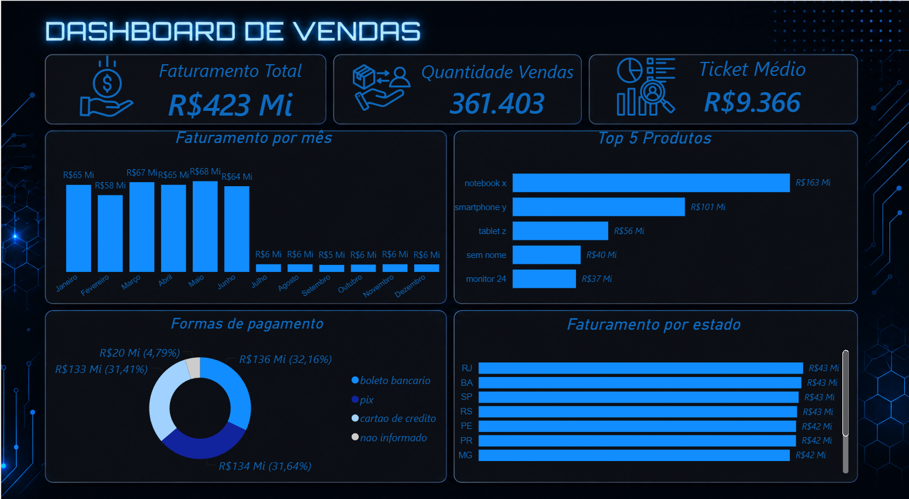

> Sales ETL Pipeline

━━━━━━━━━━━━━━━━━━━━━━━━━━━━━━━━━━━━━━━━━━━━━━━━━━━━━
➞ Sobre

Este projeto simula um cenário onde uma empresa recebe dados de vendas desorganizados em arquivos CSV e precisa prepará-los para análise.

O pipeline automatiza esse processo, evitando a necessidade de corrigir os dados manualmente.

> 𝗘𝘅𝘁𝗿𝗮𝗰𝘁 → 𝗧𝗿𝗮𝗻𝘀𝗳𝗼𝗿𝗺 → 𝗟𝗼𝗮𝗱

Os dados são extraídos do CSV, passam por limpeza e padronização utilizando Python e Pandas e depois são carregados no PostgreSQL.

Durante esse processo são tratados problemas como dados nulos, duplicidades, preços em formatos diferentes, nomes inconsistentes, datas inválidas e outros dados fora do padrão.

Após o tratamento, os dados ficam prontos para consultas SQL e análise através de um dashboard no Power BI.

O objetivo é demonstrar, na prática, como um processo ETL pode transformar dados brutos e inconsistentes em dados prontos para análise.

━━━━━━━━━━━━━━━━━━━━━━━━━━━━━━━━━━━━━━━━━━━━━━━━━━━━━

➞ Tecnologias

- Python
- Pandas
- NumPy
- SQLAlchemy
- PostgreSQL
- SQL
- Power BI
- python-dotenv
- Git
- GitHub

━━━━━━━━━━━━━━━━━━━━━━━━━━━━━━━━━━━━━━━━━━━━━━━━━━━━━

➞ Dashboard

Dashboard desenvolvido no Power BI para análise dos dados de vendas.

━━━━━━━━━━━━━━━━━━━━━━━━━━━━━━━━━━━━━━━━━━━━━━━━━━━━━

➞ Como Executar

Instale as dependências:

pip install -r requirements.txt

Renomeie o `.env.example` para `.env` e preencha as informações de conexão com o PostgreSQL.

Execute o pipeline:

python scripts/main.py

Também é possível executar pelo `run.bat`.

━━━━━━━━━━━━━━━━━━━━━━━━━━━━━━━━━━━━━━━━━━━━━━━━━━━━━

➞ Autor

Breno
